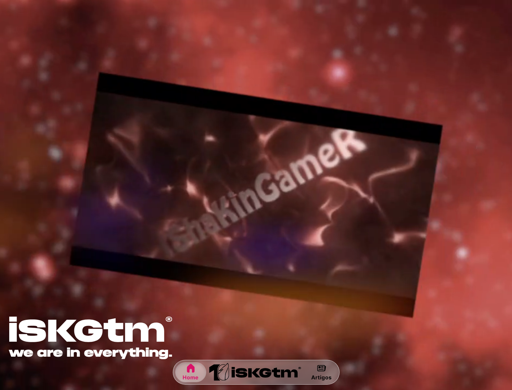
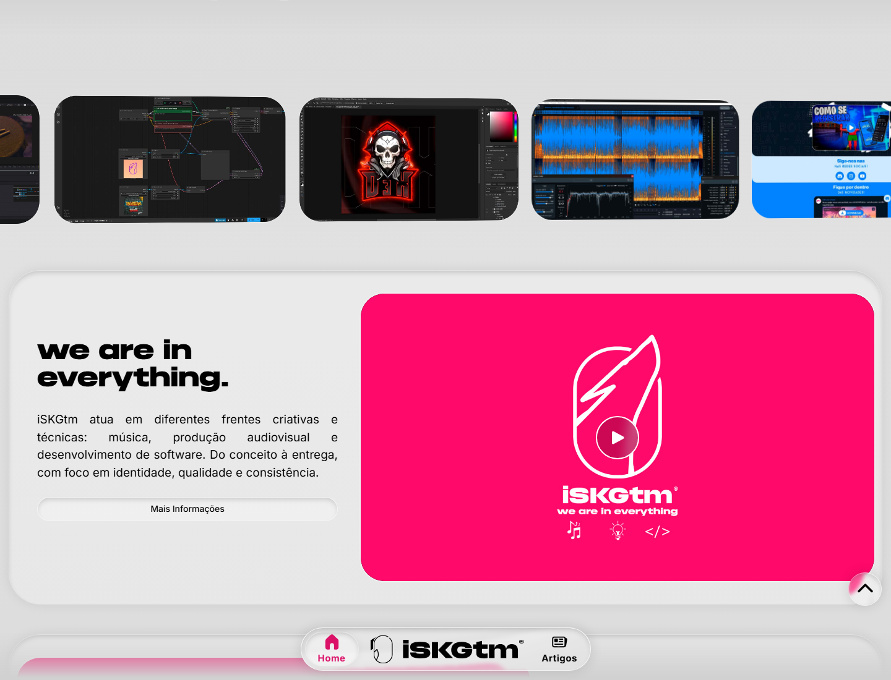
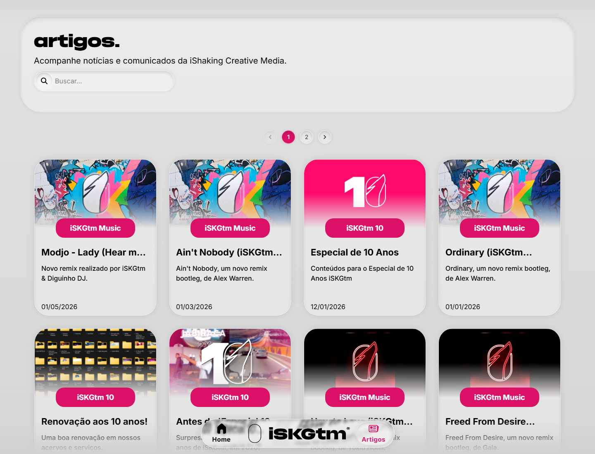
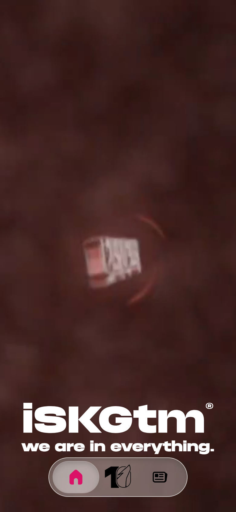

# iSKGtm Hub

iSKGtm Hub é o site central da iShaking Creative Media: um espaço para reunir projetos, noticias, artigos e entregas criativas ligadas ao iSKGtm.

A iShaking Creative Media é a entidade-mãe da iSKGtm. Ela é responsável pela marca iSKGtm, suas submarcas e sua logomarca, servindo como base institucional e criativa para o ecossistema do projeto.

O hub apresenta diferentes frentes de trabalho, como música, produção audiovisual, desenvolvimento web e outros projetos autorais. A ideia e servir como uma porta de entrada visual e organizada para conhecer o ecossistema iSKGtm, acessar conteúdos publicados e acompanhar novas atualizações.

> Versão atual do projeto: **26.2**

## Sobre o Projeto

O iSKGtm atua em diferentes áreas criativas e técnicas, do conceito a entrega, com foco em identidade, qualidade e consistencia.

Principais seções do hub:

- **Home:** apresentação institucional, carousel visual, vídeo de destaque e principais áreas do projeto.
- **Artigos:** publicações, novidades, notas de atualização e conteúdos envolvendo iSKGtm.
- **iSKGtm Music:** espaço dedicado a faixas, remixes, produções e trabalhos musicais.
- **iSKGtm Prod.:** produção audiovisual, edição, motion graphics e pacotes visuais.
- **iSKGtm Dev.:** desenvolvimento de aplicações e webapp, interfaces modernas, performance, UI/UX e técnicas de Eng. de Softwares.

## Tecnologias

Este projeto foi construido com:

- React
- TypeScript
- Vite
- Material UI
- Framer Motion
- React Router
- Tailwind CSS

## Como Rodar Localmente

Instale as dependências:

```bash
npm install
```

Inicie o servidor de desenvolvimento:

```bash
npm run dev
```

Gere a build de produção:

```bash
npm run build
```

Visualize a build localmente:

```bash
npm run preview
```

## Links

- Site oficial: [https://iskgtm.com](https://iskgtm.com)
- Deploy Vercel: [https://iskgtm.vercel.app/home](https://iskgtm.vercel.app/home)

## Capturas da Interface

### Home



### Seções da Home



### Artigos



### Mobile



## Estrutura Geral

```text
src/
  components/      Componentes reutilizaveis da interface.
  data/            Dados locais, como noticias e parceiros.
  pages/           Páginas principais do hub.
public/
  images/          Logos, simbolos, thumbnails e imagens de artigos.
  videos/          Vídeos de background e seções institucionais.
  pdf/             Arquivos públicos, como curriculo.
```

## Status

Projeto em operação e manutenção continua.

## Copyright e Créditos

© 2016-2026 iShaking Creative Media.

- Atribuições Legais: [/artigo/atribuicoes](https://iskgtm.com/artigo/atribuicoes)
- Linktree: [https://linktr.ee/iSKGtm](https://linktr.ee/iSKGtm)
- LinkedIn: [https://www.linkedin.com/in/iskgtm/](https://www.linkedin.com/in/iskgtm/)
- YouTube: [https://youtube.com/iskgtm](https://youtube.com/iskgtm)
